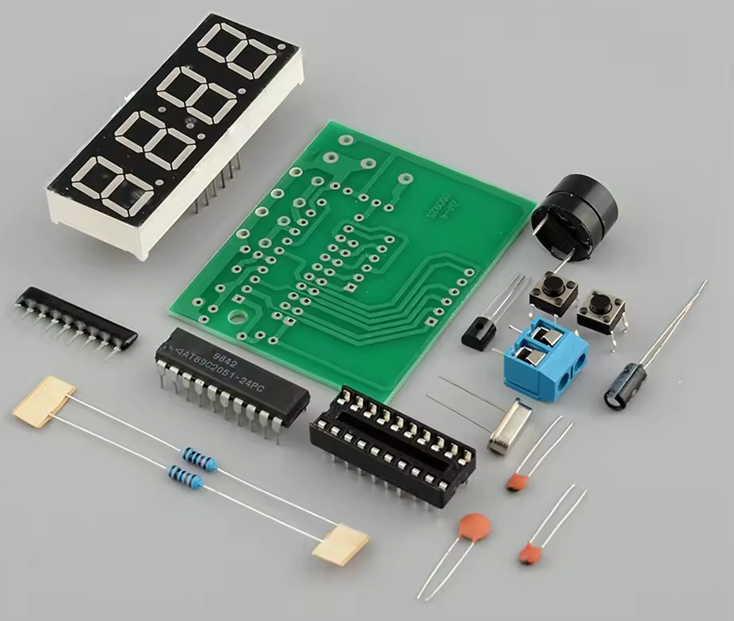
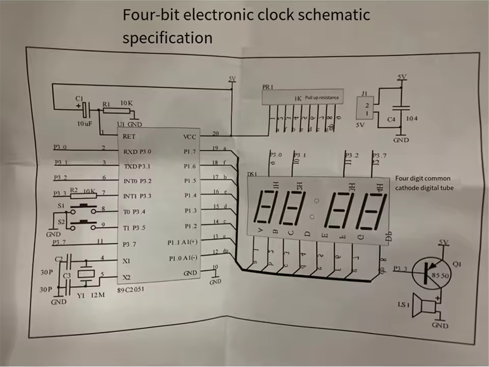
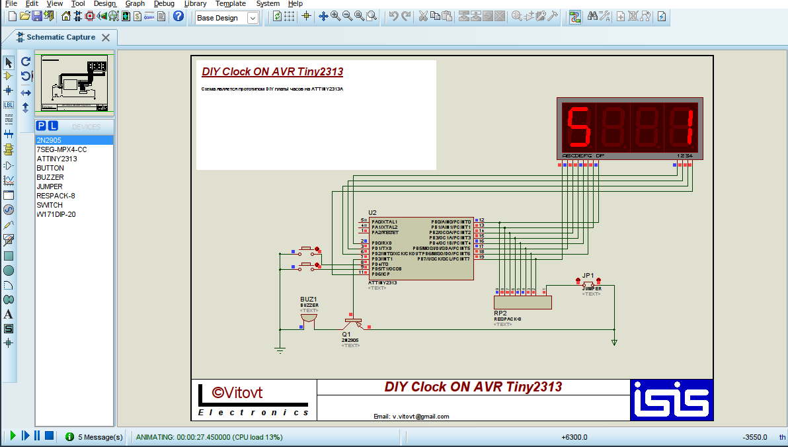
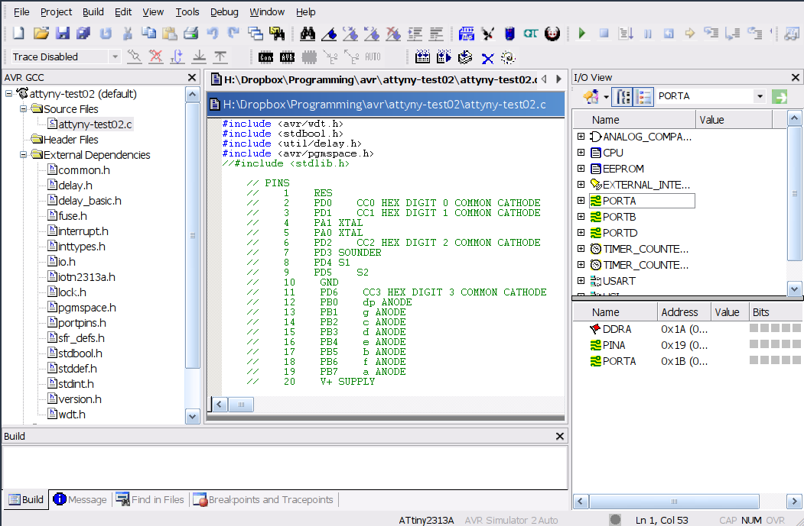

# 🕒 ClockHack2313

## Screenshots

 

 

https://github.com/user-attachments/assets/382203ee-8fdf-477a-9bad-db51eeb9bcae

[🇺🇦 Українською](#-навчальний-хак-набору-годинника-на-базі-attiny2313) [🇩🇪 Auf Deutsch](#-ein-lehrprojekt-auf-basis-eines-diy-uhr-kits-mit-attiny2313) [🇬🇧 English version](#-educational-hack-of-a-clock-kit-based-on-attiny2313)

---

## — навчальний хак набору годинника на базі ATtiny2313

Приховати деталі

**ClockHack2313** — це навчальний проєкт, який дозволяє дешево й ефективно вивчати мікроконтролери AVR (зокрема ATtiny2313), роботу з виводом на 7-сегментний дисплей, зчитуванням кнопок, генерацією звуку та використанням таймерів.  
Цей проєкт створений на базі недорогого DIY-набору годинника, доступного на Amazon, AliExpress та подібних платформах.

Проект був розроблений в рамках викладання курсу "основи пайки та електроніки" під час моєї роботи в школі.

> Основна проблема з якою я зіткнувся під час викладання курсу — різний рівень підготовки учнів. Класична побудова такого курсу — лінійний підхід до навчання. Це — коли треба робити певні кроки послідовно і без виконання попереднього рухатися далі неможливо. Для аудиторії з учнів різного рівня підготовки це неприйнятно.
> 
> Таким чином, я створив умови для комфортної роботи з різношерстною групою. Просунуті встигали спаяти схему, погратися з симуляцією і переписати код. А менш досвідчені — могли зосередитися хоча б на пайці або просто на вивченні через готову емуляцію.

📄 [Перейти до повного опису українською →](README_uk.md)

---

## — ein Lehrprojekt auf Basis eines DIY-Uhr-Kits mit ATtiny2313

Details ausblenden

**ClockHack2313** ist ein Lernprojekt, das eine kostengünstige und effektive Möglichkeit bietet, AVR-Mikrocontroller (insbesondere ATtiny2313) zu erlernen — einschließlich der Arbeit mit 7-Segment-Displays, Tasten, Summern und Timern.  
Das Projekt basiert auf einem preiswerten DIY-Uhrenbausatz, der auf Plattformen wie Amazon oder AliExpress erhältlich ist.

Dieses Projekt wurde im Rahmen meines Elektronik- und Löttechnik-Kurses an einer Schule entwickelt.

> Die größte Herausforderung beim Unterrichten war das **unterschiedliche Vorwissen** der Schüler. Klassische lineare Kursstrukturen, bei denen jeder Schritt auf dem vorherigen aufbaut, funktionieren in so heterogenen Gruppen nicht.
>
> Ich habe deshalb ein flexibles System geschaffen: Fortgeschrittene Schüler konnten die Schaltung löten, Simulationen durchführen und eigenen Code mit IO und Interrupts schreiben. Weniger erfahrene Schüler konnten sich auf das Löten konzentrieren oder zumindest mit der vorbereiteten Simulation experimentieren.

📄 [Zur vollständigen deutschen Beschreibung →](README_de.md)

---

## — educational hack of a clock kit based on ATtiny2313

Hide details

**ClockHack2313** is an educational project designed to provide a cheap and effective platform for learning AVR microcontrollers (especially ATtiny2313), including display output, button input, sound generation, and timer use.  
The project is based on an affordable DIY clock kit widely available on Amazon, AliExpress, and similar sites.

It was developed during my time teaching a school course in basic soldering and electronics.

> The main challenge I faced while teaching was the **varying skill levels** of students. Traditional linear learning paths (where each step depends on the previous one) just don’t work in mixed-experience classrooms.
>
> That’s why I created an environment where students could engage at different levels: advanced students could solder the board, play with simulation, and extend the code. Less experienced students could at least solder the board or experiment with the ready-to-run simulation.

📄 [Go to full English description →](README_en.md)

---

[🇺🇦 Українською](#-навчальний-хак-набору-годинника-на-базі-attiny2313) [🇩🇪 Auf Deutsch](#-ein-lehrprojekt-auf-basis-eines-diy-uhr-kits-mit-attiny2313) [🇬🇧 English version](#-educational-hack-of-a-clock-kit-based-on-attiny2313)

---

