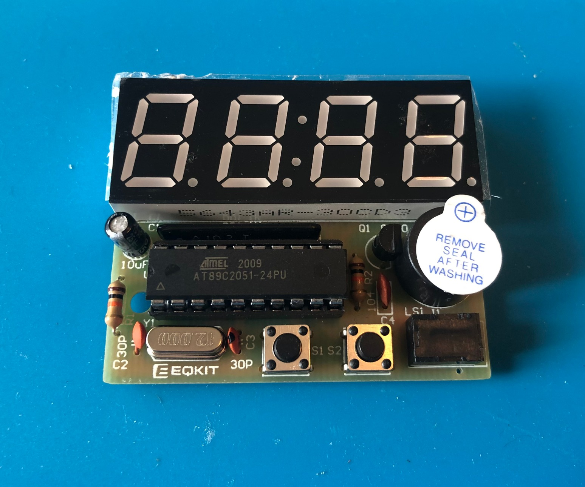
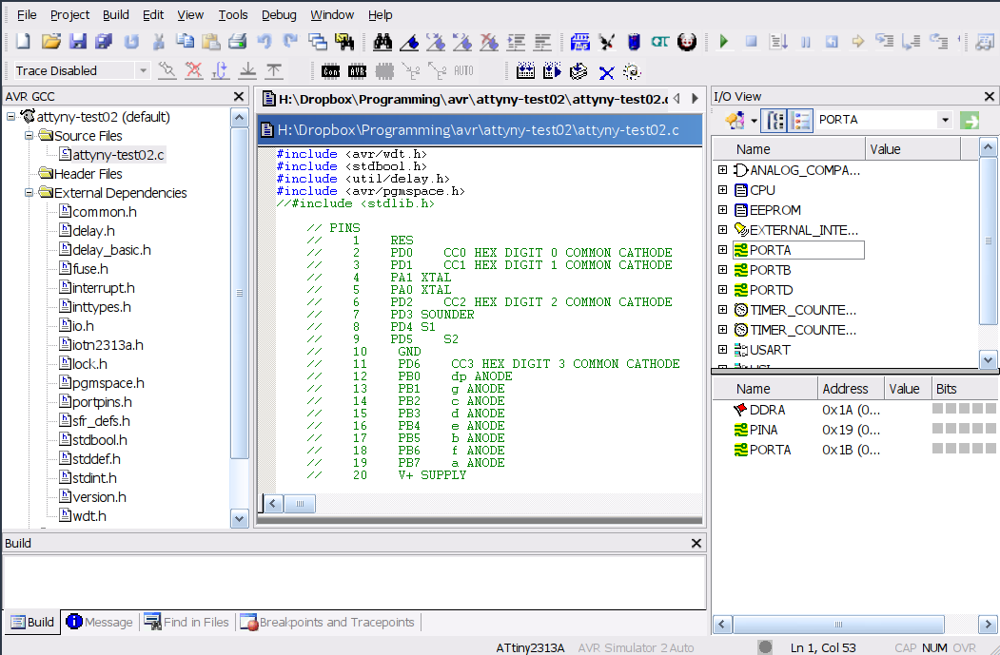
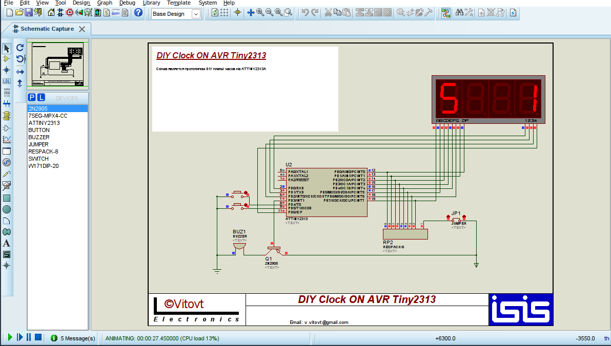

# 🕒 ClockHack2313  
## — Ein Bildungs-Hack eines DIY-Uhr-Bausatzes auf Basis des ATtiny2313

**ClockHack2313** ist ein Bildungsprojekt, das ermöglicht, **günstig** und effektiv das Arbeiten mit AVR-Mikrocontrollern (insbesondere ATtiny2313) zu erlernen – inklusive Ansteuerung von 7-Segment-Anzeigen, Tastenabfrage, Tonerzeugung und Nutzung von Timern.

Ich habe dieses Projekt verwendet, um Schülern das Löten und Programmieren beizubringen. Es musste also einfach, kostengünstig und für fast alle umsetzbar sein.

Die größte Herausforderung im Unterricht

> war der unterschiedliche Wissensstand der Teilnehmer. Klassische Lernmethoden mit linearem Aufbau – Schritt für Schritt ohne Möglichkeit, einen zu überspringen – funktionierten bei einer gemischten Lerngruppe nicht.
> 
> Deshalb habe ich das Projekt so gestaltet, dass es für alle Niveaus geeignet ist. Fortgeschrittene Schüler konnten die Schaltung löten, simulieren und den Code erweitern (z. B. um eigene IO- oder Interrupt-Logik). Anfänger konnten entweder nur die Uhr bauen oder zumindest mit der vorgefertigten Simulation spielen und das Verhalten verstehen.

---

<strong>Als Basis diente ein günstiger DIY-Bausatz</strong>

Ein typischer Lötbausatz für eine elektronische Uhr, erhältlich auf Amazon, AliExpress etc. – günstig und weit verbreitet.

Die Platine besteht aus hochwertigem Material (zumindest bei meinen Exemplaren), und selbst absolute Anfänger konnten keine Leiterbahnen beschädigen – ideal für den Einstieg ins Löten.

Auch der DIP-Gehäuse-Mikrocontroller ist leicht zu verlöten, im Gegensatz zu SMD-Versionen.

Der Bausatz enthält einen vorprogrammierten **89C2051**, der einfach in einen DIP-20-Sockel eingesetzt wird – kein Löten nötig. Einige Schüler nutzten ihn direkt als fertige Uhr.

Für den weiteren Lernprozess habe ich diesen durch einen **ATtiny2313** ersetzt, der dieselbe Pinbelegung, aber eine modernere Architektur hat.  
Diese Architektur ist ein guter Ausgangspunkt für AVR-Programmierung.

Zusätzlich basiert ein Großteil der **Arduino-Boards** ebenfalls auf AVR, was einen fließenden Übergang zu komplexeren Projekten ermöglicht.

⚠️ **Einzige Hardware-Änderung:** Der Reset-Pin (Pin 20) ist beim ATtiny2313 invertiert.  
Beim 89C2051 war ein Pull-Down-Widerstand gegen GND nötig, beim ATtiny2313 muss dieser auf **VCC** gelegt werden.

---

<strong>Zur Demonstration habe ich eine kleine C-Firmware geschrieben</strong>

Sie befindet sich im Ordner `firmware`, geschrieben in **AVRStudio** (ältere Version) und kompiliert mit **AVR-GCC**.

Die Firmware zeigt: Anzeige von Zeichen auf dem Display, Tastenabfrage mit Entprellung, Tonerzeugung über einen Buzzer, Timer-Nutzung und Interrupt-Verarbeitung – perfekt zum Üben typischer Mikrocontroller-Funktionen.

---

<strong>Zum Debuggen ohne Löten</strong>

Die gesamte Schaltung wurde vollständig im **Proteus 8 Schematic Simulator** modelliert.  
Die mit **GCC** kompilierte HEX-Firmware wurde in einen emulierten **ATtiny2313** geladen (der von Proteus nativ unterstützt wird), sodass das Verhalten **vollständig beobachtet und schrittweise debuggt** werden kann – ganz ohne zu löten.

Das bringt viele Vorteile mit sich:  
Schüler, die noch nicht löten können oder keine Zeit hatten, die Schaltung aufzubauen, können sofort damit „spielen“ und sehen, was sie macht.  
Experimente im Emulator schützen die reale Schaltung vor Schäden – zum Beispiel, wenn Ports falsch konfiguriert sind (z. B. Ausgang statt hochohmigem Eingang), was zu einem Kurzschluss führen kann.

Auch insgesamt geht das Debugging im Emulator viel schneller, weil man den Mikrocontroller nicht jedes Mal aus dem Sockel nehmen und neu flashen muss.

Ein Beispielvideo zeigt, wie das aussieht:

https://github.com/user-attachments/assets/382203ee-8fdf-477a-9bad-db51eeb9bcae

---

### 🎯 Projektziele

- Eine **günstige und einfache Hardware-Plattform** für AVR-Löten und -Programmierung bieten
- Elektronik-Löten lehren
- Die **komplette Simulation in Proteus** ermöglichen – ganz ohne Hardware
- **Low-Level-Programmierung und Mikrocontroller-Grundlagen** fördern
- Sowohl Einsteiger als auch Fortgeschrittene sinnvoll einbinden

---

### 🧰 Projektinhalt

- Modifizierter DIY-Uhr-Bausatz mit **ATtiny2313** als Mikrocontroller
- Demo-Firmware in **C** für AVR-GCC (Anzeige, Tasten, Buzzer, Timer)
- Komplette **Simulation in Proteus** mit Schritt-für-Schritt-Debugging
- **Fotos der aufgebauten Platine**, Screenshots aus Proteus und AVR Studio
- Fertige `.hex`-Datei zum Flashen
- Projektdateien für AVR Studio (ältere Version)

---

### 🧠 Was man lernen kann

- Arbeit mit GPIO: Segmentanzeige, Taster, Buzzer
- Timer, Delays und Interrupts
- Lauftext-Effekte auf 7-Segment-Displays
- Einfache Logikspiele und Animationen
- **Simulation und Debugging in Proteus**
- Struktur einer C-Firmware für AVR
- Umgang mit `ISR`, Entprellung, GPIO-Modi

---

### ⚙️ Schaltung & Komponenten

- 4-stellige **7-Segment-Anzeige mit gemeinsamer Kathode**  
  (Anoden an PB0–PB7, Kathoden an PD0,1,2,6)
- 2 Taster (PD4 und PD5)
- Buzzer mit Transistortreiber (PD3)
- Mikrocontroller **ATtiny2313** im DIP-20-Gehäuse (anstelle von 89C2051)
- RST-Widerstand auf VCC verschoben (inverser Reset beim ATtiny2313)
- Platine aus dem DIY-Uhr-Bausatz

---

### 🛠️ So starten Sie

1. DIY Clock Kit kaufen oder zusammenbauen
2. **89C2051 durch ATtiny2313 ersetzen**
3. **RST-Widerstand von GND auf VCC umlöten**
4. `.hex`-Datei mit USBasp oder anderem Programmer flashen
5. Einschalten – und das Demo beobachten

_Alternativ_ — öffnen Sie einfach die `.dsn`-Datei in **Proteus 8** – kein Löten nötig!

---

### 📸 Screenshots

  

---

### 📜 Lizenz

Freie Nutzung zu Bildungszwecken mit Namensnennung des Autors.

[Creative Commons Attribution 4.0 International (CC BY 4.0)](LICENSE)

Der Autor übernimmt keine Haftung für das, was du lernst – oder umlötest 😉
