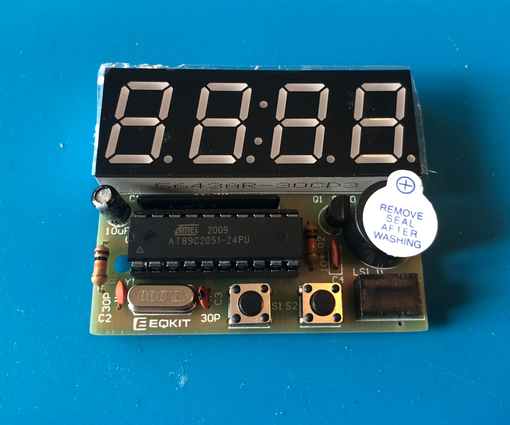

# 🕒 ClockHack2313 
## — навчальний хак набору годинника на базі ATtiny2313

**ClockHack2313** — це навчальний проєкт, який дозволяє **дешево** й ефективно вивчати мікроконтролери AVR (зокрема ATtiny2313), роботу з виводом на 7-сегментний дисплей, зчитуванням кнопок, генерацією звуку та використанням таймерів.  

Я використовува цей проект для навчання школярів паяти та програмувати. Тому це повинно було бути просто, дешево і вийти у всіх, чи майже всіх учнів.

Основна проблема з якою я зіткнувся

> під час викладання курсу - різний рівень підготовки учнів. Класична побудова такого курсу - лінійний підхід до навчання. Це - коли треба робити певні кроки послідовно і без виконання попереднього рухатися далі неможливо. Для аудиторії з студентів різного рівня підготовки категорично не можна застосовувати. 
> 
> Таким чином, я зробив всі умови для роботи з різношерстною групою студентів різного рівнея підготовки. Самі продвинуті встигали і спаяти схему і погратися з симуляцією і переписати код, дописавши роботу з IO та перериваннями. А в кого менше досвіду/часу/бажання - мали можливість або годинник спаяти, або, хоча б, погратися з готовою емуляцією - як воно повинно бути вживу.

---

<strong>За основу я взяв готовий DIY набір</strong>

набір для пайки електронного годинника, що доступний на amazon, aliexpress і т.д. В великих кількостях та дешево.
Плата зроблена з якісного текстоліту (як мінімум та, що мені потрапляла на очі) і навіть недосвідчені школярі не змогли перегрівати доріжки так, щоб вони повідпадали. Що дуже  важливо для людей, які тільки знайомляться з паяльником.
Також там був DIP корпус для процесора, який теж легко паяти в порівнянні з SMD корпусом.

В комплекті йде процесор (мікроконтроллер) 89c2051 попередньо запрограмований під годинник. Він вставляється в DIP 20 панельку, так, що його паяти не треба. Деякі учні цим і обмежувалися, використовуючи схему як годинник.

Для подальшого навчання, я замінив цей процесор ідентичним по розпіновці AtTiyn2313 з більш сучасною архітектурою. (Я вважаю, що починати вивчати варто з цієї архітектури, як більш продвинутої).
Крім того, популярні Arduino теж мають AVR архітектуру в більшості, що спрощує подальшу розробку більш серйозних проектів на базі Arduino.

ЄДИНИЙ момент, крім переставлення мікросхеми в панельці, це те, що сигнал RST на 20 ніжці в ATtiny2313 інвертоварний. Тому в 89c2051 він замкнений на землю через резистор, а для attiny2313 треба резистор переставити на плюс живлення.

---

<strong>Для демонстрації роботи я розробив простеньку програмку на мові C, яка</strong>

знаходиться в теці `firmware` використовуючи AVRStudio (доволу стару версію) та AVRgcc компілятор.
В цій програмі реалізований простий вивід на екран символів, взаємодія з кнопками, подавлення брязкоту контактів, виведення сигналу через бузер, робота з перериваннями. Що дає можливість потренуватися працювати з основними компонентами будь-якого сучасного мікроконтролера.

<strong>Для відладки без необхідності щось паяти</strong>

змоделював повністю цю схему в Proteus 8 Schematic simulator. Залив скомпільовану за допомогою GCC HEX прошивку в емульований процесор (процесор attiny2313 підтримується в Proteus з коробки) і маю можливість ПОВНІСТЮ побачити роботу, покроково відлажувати всю програму в Proteus без необхідності пайки.

Тут відразу багато переваг: студенти, які не вміють паяти, або не встигли спаяти схему - можуть відразу з нею "погратися" та побачити, що вона робить. Експерименти на емуляторі захищають схему від пошкоджень, зокрема коли неправильно налаштовані порти (замість Z-стану, коли порт налаштований як вхід - помилково стоїть вихід) і відбувається замикання плюс на мінус.

Та і взагалі відладка на емуляторі відбувається набагато швидше, бо не витрачається час на фізичне витягування мікроконтролера з панельки і перепрошивку програматором.

Детальніше, як це виглядає - можна подивитися в відео:

<strong>Відео Proteus емуляції (натисніть, щоб розгорнути)</strong>

https://github.com/user-attachments/assets/382203ee-8fdf-477a-9bad-db51eeb9bcae

---

### 🎯 Цілі проєкту

- Надати **дешеву й просту апаратну платформу** для навчання пайці та програмуванню AVR
- Навчити паяти електроні схеми
- Дати змогу **емулювати всю схему в Proteus**, без пайки
- Прокачати **навички низькорівневого програмування та роботи з мікроконтролерами**
- Щоб користь від навчання отримали як і учні знайомі з пайкою/програмуванням так і без базових навичок

---

### 🧰 Що включає проєкт

- Модифікований набір годинника з заміною мікроконтролера на **ATtiny2313**
- Демонстраційна програма на мові **C** для AVR-GCC (вивід на екран, кнопки, бузер, таймер)
- Повна **симуляція в Proteus** з можливістю покрокової відладки
- **Фото зібраної плати**, скріншоти Proteus та AVR Studio
- Готовий `.hex` файл для прошивки
- Проєкт AVR Studio (старої версії)
    
---

### 🧠 Чому можна навчитися

- Робота з GPIO: дисплей, кнопки, бузер
- Затримки та таймери (в т.ч. переривання)
- Ефект “бігучого рядка” на дисплеї
- Проста логіка ігор та анімацій
- Перевірка й покроковий дебаг у симуляторі **Proteus**
- Основи структури C-програми для AVR
- Робота з `ISR` (перериваннями), debounce (подавлення брязкоту контактів), перемикання режимів GPIO
---

### ⚙️ Схема та компоненти

- 4-розрядний 7-сегментний індикатор зі спільним катодом (аноди на PB0-PB7, катоди на PD0,1,2,6)
- 2 кнопки (PD4 і PD5)
- Бузер із транзистором (PD3)
- Мікроконтролер **ATtiny2313** у DIP-20 корпусі (заміна 89С2051 зі стандартного комлпекту)
- Резистор на RST перенесено на VCC (через інверсію в ATtiny2313)
- Плата з комплекту годинника (DIY clock kit)

---

### 🛠️ Як запустити

1. Придбати/зібрати годинниковий набір (DIY Clock Kit)
2. Замість 89C2051 вставити **ATtiny2313**
3. **Перепаяти резистор на RST** з GND на VCC
4. Прошити `.hex` файл через USBasp або інший програматор
5. Запустити — і побачити демо

_Або_ — просто запустити `.dsn` файл у **Proteus 8**, і побачити все без пайки!

---

### 📸 Скріншоти

  

---

### 📜 Ліцензія

Вільне використання з навчальною метою за умови обовʼязкового зазначення автора.

[Creative Commons Attribution 4.0 International (CC BY 4.0)](LICENSE)

Автор не несе відповідальності за вивчене й перепаяне 😉
